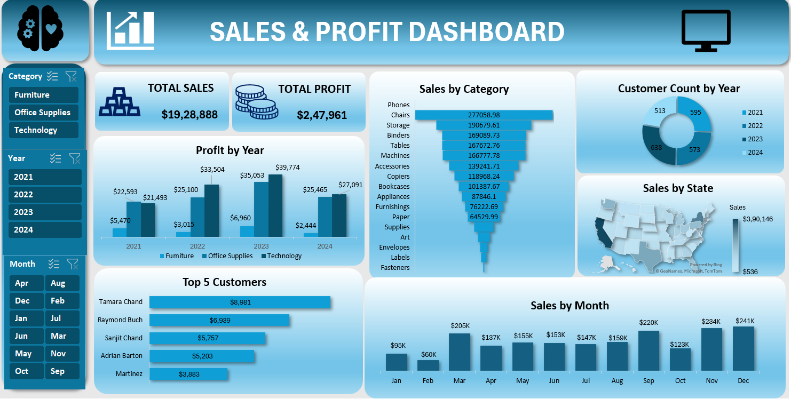

```markdown
# 📊 Sales & Profit Dashboard using Microsoft Excel



---

# 🚀 Project Overview

This project is an interactive **Sales & Profit Dashboard** developed completely using **Microsoft Excel**.  

The dashboard helps analyze business performance by providing insights into:
- 💰 Total Sales
- 💵 Total Profit
- 📈 Yearly Profit Trends
- 🛒 Category-wise Sales
- 👥 Customer Analysis
- 🗺️ State-wise Sales
- 📅 Monthly Sales Trends

The main purpose of this project is to transform raw sales data into meaningful visual insights that support better business decision-making.

---

# 🎯 Project Objective

The objective of this dashboard is to:
- Analyze overall business performance
- Identify profitable product categories
- Track monthly and yearly sales trends
- Identify top-performing customers
- Visualize state-wise sales distribution
- Create an interactive and user-friendly dashboard

---

# 🛠️ Tools & Technologies Used

- 📗 Microsoft Excel
- 📊 Pivot Tables
- 📈 Pivot Charts
- 🎛️ Slicers
- 🗺️ Map Charts
- 📌 KPI Cards
- 🎨 Dashboard Designing Techniques
- 📉 Data Visualization

---

# 📂 Dataset Information

The dataset contains:
- Customer Details
- Product Categories
- Sales Data
- Profit Data
- State-wise Transactions
- Monthly Records
- Yearly Sales Information

The data was cleaned and organized before creating the dashboard.

---

# 📊 Dashboard Features

## 🔹 KPI Cards
The dashboard displays key business metrics:
- 💰 **Total Sales:** $19,28,888
- 💵 **Total Profit:** $2,47,961

These KPI cards provide a quick summary of business performance.

---

## 📈 Profit by Year
This chart compares yearly profits across:
- Furniture
- Office Supplies
- Technology

### Key Insights
✅ Technology category generated the highest profit  
✅ 2023 recorded maximum profit  
✅ Slight profit decline observed in 2024  

---

## 🛒 Sales by Category
This funnel chart displays category-wise sales performance.

### Top Performing Categories
📱 Phones  
🪑 Chairs  
📦 Storage  

### Low Performing Categories
🏷️ Labels  
📎 Fasteners  
✉️ Envelopes  

### Insight
Technology-related products contributed significantly to overall revenue.

---

## 👥 Customer Count by Year
This donut chart visualizes customer growth over the years.

### Insight
Customer engagement remained stable with slight growth in recent years.

---

## 🗺️ Sales by State
The map chart displays sales distribution across different states.

### Insight
Some states generated significantly higher sales compared to others.

---

## 🏆 Top 5 Customers
This chart highlights the top customers contributing to revenue.

### Top Customers
🥇 Tamara Chand — $8,981  
🥈 Raymond Buch — $6,939  
🥉 Sanjit Chand — $5,757  

### Insight
A small group of customers contributes a large portion of overall sales.

---

## 📅 Sales by Month
This chart shows monthly sales trends.

### Highest Sales Months
🎄 December — $241K  
🍂 November — $234K  
📚 September — $220K  

### Lowest Sales Month
📉 February  

### Insight
Sales increased significantly during festive and year-end seasons.

---

# 🎛️ Interactive Features

The dashboard includes slicers for:
- 📂 Category
- 📅 Year
- 🗓️ Month

These slicers allow users to dynamically filter and analyze the data.

---

# 🎨 Dashboard Design Highlights

✅ Professional and clean layout  
✅ Interactive filters and slicers  
✅ Attractive blue theme design  
✅ Business-focused insights  
✅ Easy-to-understand visualizations  

---

# 📚 Skills Demonstrated

This project helped improve:
- 📊 Data Analytics
- 📈 Data Visualization
- 📗 Microsoft Excel
- 🧠 Business Intelligence
- 🎨 Dashboard Designing
- 📂 Data Cleaning
- 📌 Insight Generation

---

# 🔥 Business Insights

- 💻 Technology products generated maximum profit
- 📱 Phones recorded highest sales
- 📅 December showed highest monthly sales
- 🏆 Top customers contributed major revenue
- 🗺️ Certain states dominated sales performance

---

# 🏁 Conclusion

The **Sales & Profit Dashboard** successfully transforms raw business data into meaningful business insights using Microsoft Excel.

This project demonstrates how Excel can be used as a powerful tool for:
- Business Analysis
- Dashboard Reporting
- Data Visualization
- Decision Making

It enhanced my understanding of real-world business analytics and interactive dashboard development.

---

# 🙌 Connect With Me

## 👨‍💻 Mahesh Kuruba

- 💼 LinkedIn: www.linkedin.com/in/mahesh-kuruba-5032b12a5
- 📊 Interested in Data Analytics & Dashboard Development

---

# ⭐ If You Like This Project

🌟 Star the repository  
🍴 Fork the project  
📢 Share your feedback  

---

# 📌 Preview


```
